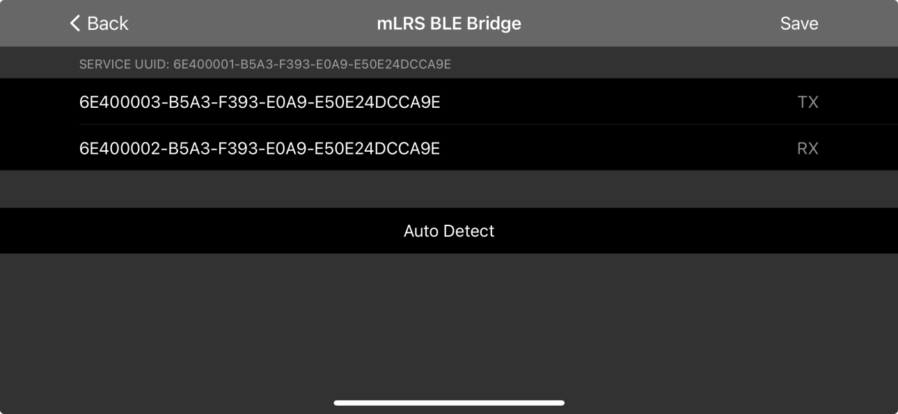

# nomad-ble-bridge

## Details

A BLE bridge for the ESP32-C3 on the RadioMaster Nomad.

## SidePilot Settings

Note the end of the first portion of the string differs:
- 00003 is TX
- 00002 is RX

